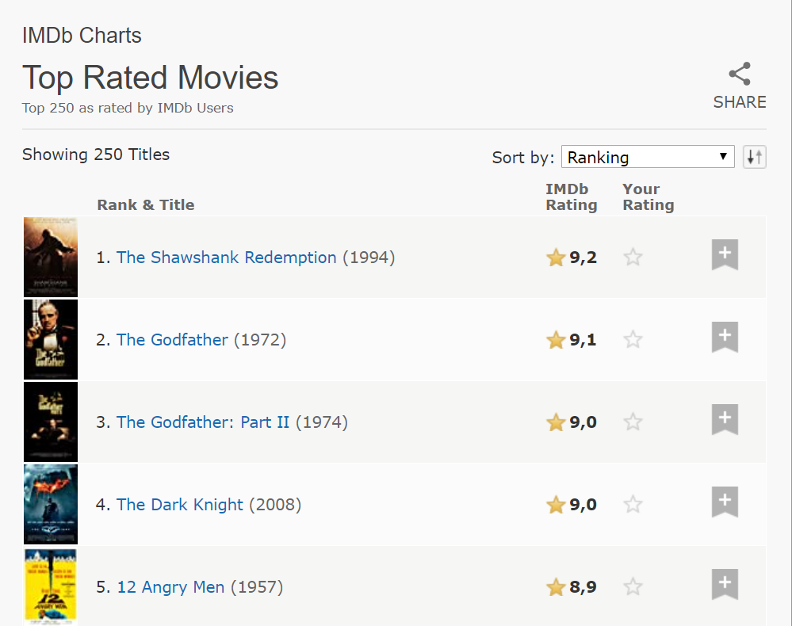

# Web Scrapper
> A web scrapper project from IMDB.com TOP250 rated movies



<br>The aim of the project is to scrap data from IMBD website and give to user an opportunity to search movie by place in the ranking or by title instead of looking for manually<br>

## Content

* [Requirements](#requirements)
* [Built With](#built-with)
* [Quick Start](#quick-start)
* [Install](#install)
* [Contributing](#contributing)
* [Acknowledgments](#acknowledgments)
* [Author](#author)
* [License](#license)

## How program runs
* Welcome message
* The program gives a choice to user to search by PLACE (type '1') or by TITLE (type '2')
* If user choose by PLACE, he/she should type number from 1 to 250, after user will see a movie title
* If user choose by TITLE, he/she should type a title of movie, after user will see a movie's place in the ranking
* After that you can choose to continue searching ('Y') or to stop the program ('N')

## Requirements

<ul>
  <h3>Features</h3>
  <li>Scrap information from any website</li>
  <li>Use Nokogiri.gem</li>
</ul>

### Built With

- Ruby <br>
- Rubocop (Linter) with Stickler (CI Tool)<br>
- Git (with Gitflow), Github and VScode <br>
- RSPEC <br>

## Quick Start

#### Get a local copy with:<br>
```js
git clone https://github.com/NiiazalyDzhumaliev/ruby_capstone/tree/feature_branch
```
Or just hit (Download Zip) on green button (Clone or Download) on top of this page.

### Install

* Ruby Language - Version 2.5.5. or higher - [Install guide](https://www.ruby-lang.org/en/documentation/installation/)

* Nokogiri gem - Version 1.10.9. or higher - [Install guide](https://nokogiri.org/tutorials/installing_nokogiri.html)

* HTTParty gem - Version 0.13.7. or higher - [Install guide](https://rubygems.org/gems/httparty/versions/0.13.7)


#### Run on terminal/prompt:

If you are on windows:
* Go inside the project folder
* Right shift '+' right mouse click (Float menu)
* Open prompt here (Option)
```js
ruby bin/main.rb
```
For linux:
```js
bin/main.rb
```

### Contributing

Contributions, issues and feature requests are welcome!

You can do it on [issues page](https://github.com/NiiazalyDzhumaliev/ruby_capstone/issues/1).

## Acknowledgments

A special thanks for the code reviewers and [IMBD website](https://www.imdb.com/chart/top/?ref_=nv_mv_250).

## Author

👤 **Niiazaly**

- Github: (https://github.com/NiiazalyDzhumaliev)
- Linkedin:(https://www.linkedin.com/in/niiazaly-dzhumaliev-117707132/)
- Twitter: (https://twitter.com/Niiazaly1)

### License

<strong>IMDB.com</strong>

